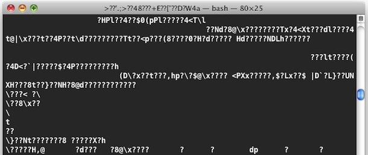

# Exquisite-corpse-NikolaasW
An exquisite corpse made by Nikolaas W - Becode

Below you will find the start of a very interesting story. A collaboration between some of the most interesting, intelligent and often disturbed minds of the students of BeCode ARAI 5.

# Story

One day a programmer fired up his terminal but found not his trusted prompt blinking at him, but instead his terminal started typing gibberish. The programmer was taken aback and started using the shortcuts he learned in his Becode session the day before, to close down the terminal as quickly as possible.
But to no avail. The programmer started to sweat and thought: "my god, I've been hacked". But that could have not been less true.

